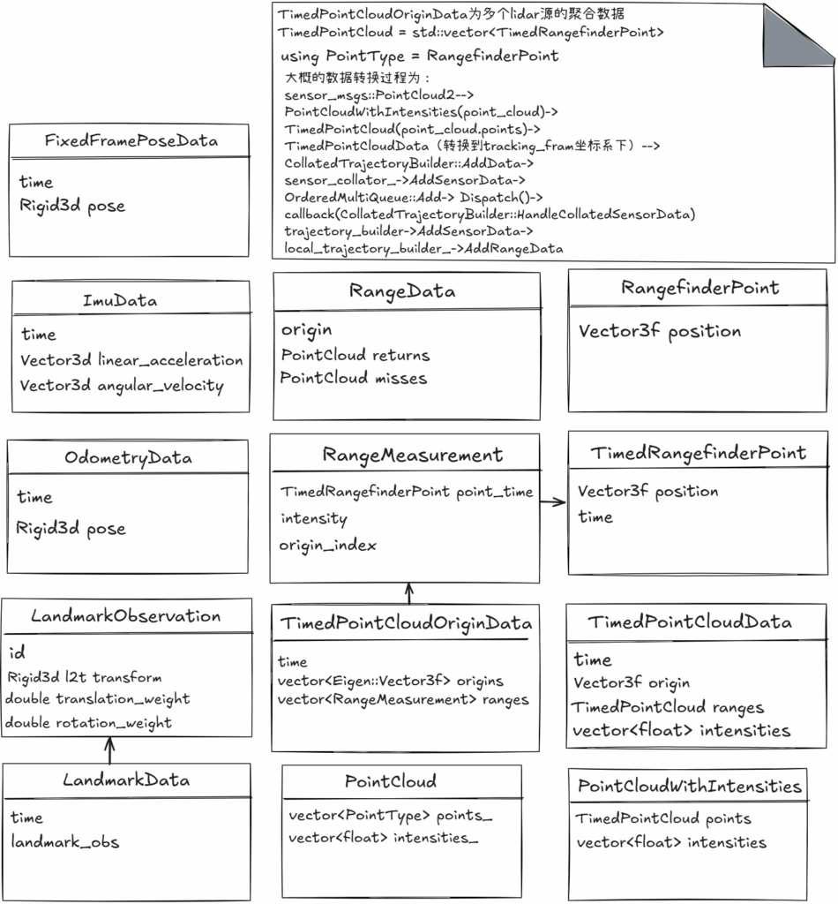

本篇文章将向大家介绍cartographer系统的sensor模块的功能的代码实现，希望对感兴趣的读者朋友们有所帮助，欢迎读者朋友阅读并对说明描述不足之处提出意见和建议。

首先，cartographer库是SLAM的算法处理核心部分，其关于sensor的数据的定义主要用于内部算法的处理，而从智能设备本体接受的sensor原始数据会由cartographer_ros的节点进行接收和发送，这里将对cartographer_ros和cartographer算法库这两部分的sensor的数据表示在一起做一下说明。

如下图所示为cartographer系统（包括ros节点）代码中数据相关的类图。其中左边一列为IMU，Odometry等其他传感器的类图，右边两列为Lidar传感器相关类图，其中右上方描述了Lidar数据在系统中的流转转换流程过程。

图1：cartographer库中sensor模块相关类图

在这里需要特别加以说明的有：在ROS节点接收通用点云数据ROS消息在SensorBridge类中转换为TimedPointCloudData类型的数据后发送给cartographer库进一步处理，TimedPointCloudData类对象数据的time成员表示为当前扫描帧点云的最晚时间，原点坐标为lidar传感器相对于tracking_frame的相对位置（一般tracking_frame定义为base_link，lua中有定义tracking_frame = “base_link”，原点定义为lidar传感器相对于base_link的位移大小，为固定的标定的值)。cartographer系统统一支持2D的LaserScan Lidar（较低成本的平面Lidar传感器）和3D Lidar传感器，对于2D LaserScan点云数据，一般会在预处理时进行切分处理(如backpack_2d.lua中定义了参数num_subdivisions_per_laser_scan = 10)，以便充分利用时间及时进行点云去畸变的计算。

在cartographer库内部，RangeDataCollator类实现了兼容多个Lidar(如backpack_3d.lua中定义了num_point_clouds = 2)传感器数据的同步融合，融合后的数据类型为TimedPointCloudOriginData，保留传感器相对于机器人本体坐标系的位移origin信息，可以计算range的大小以便进行点云的过滤操作。经过进一步的处理后的点云数据转换为RangeData，基于该数据调用ScanMatch算法优化局部位姿后对局部地图进行更新，关于整个SLAM算法流程中点云数据的坐标变换过程，ScanMatch算法实现局部位姿优化以及PoseGraph算法实现全局位姿优化等细节将在后续文章中做更加具体的说明分析。

ImuData为高频数据（频率几百到上千hz），PoseExtrapolate类实现了基于ImuData和/或OdometryData实现的机器人的位姿的较为精确的初始估计值。其中预估的大体方法为基于线速度和时间差估计位移，基于角速度和时间差积分出旋转增量估计，并且姿态外推器也基于ScanMatch的局部位姿优化结果更新time时刻更加准确的位姿，并预估出两个pose之间的匀速速度用于位移估计，在cartographer中没有采用IMU的线性加速度去进行预积分计算位姿中的translation部分(IMU的线性加速度的噪声较大，容易导致位姿漂移，而基于较为准确的位姿的变化去估计速度则较为稳定和准确，也可以基于OdometryData进行位移估计，如果有提供且数据量组足够时）。

后续文章将对cartographer的细节算法，系统架构等做进一步的介绍，欢迎关注。

References

[1]、cartographer代码仓库： cartographer-project/cartographer  
[2]、cartographer_ros代码仓库：cartographer-project/cartographer_ros  
[3]、关于传感器数据处理的更多分析说明： ./cartographer/sensors/传感器数据模块介绍.md  
