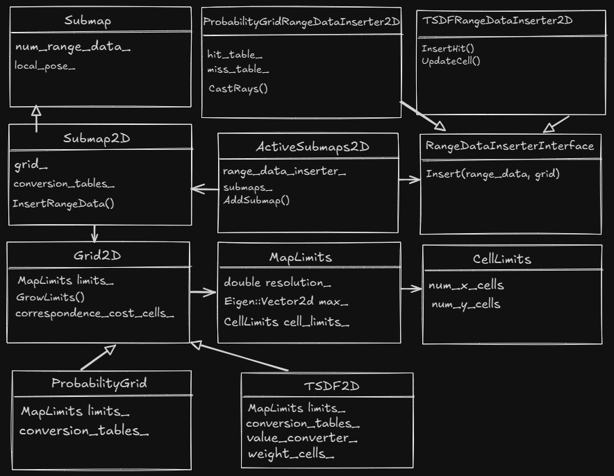

这篇文章主要的内容为cartographer系统中2D建图相关代码类图关系结构和应用功能的简要分析说明，以总览性的方式向大家介绍2D建图基础类的定义，应用功能及类对象间相互通信和依赖关系。具体的2D建图表示方法和详细逻辑将在后续专门的文章中加以详细分析阐述，欢迎大家关注并期待任何形式的意见和建议，谢谢。



图1 cartographer 2D建图类定义和相互通信依赖关系结构图

如室内地面等二维应用场景中，cartographer采用基于Grid栅格的形式来表示地图，如上类结构图所示，下面对相关类的定义，实现和相互通信和依赖关系做相关说明。

1、二维地图的表示方法所涉及的相关类中，Grid2D为表示栅格结构的基础类，其中：(1)、MapLimits类型变量limits_表示了地图结构基本信息的元数据，该对象中的resolution变量表示每个cell单元格的物理分辨率尺寸，如0.05则表示每个单元格的长宽物理尺寸为0.05米(0.05米/像素，类似地图中的scale比例尺度），max_代表MapLimits类对象x，y方向上的的最大物理尺寸，CellLimits类为单元格数目的简单封装类，cell_limits对象保存了栅格地图横向和纵向单元格数目。以上三个变量的关系通过公式表达为：max_.x() = min_x + cell_limits_.num_x_cells * resolution_。(2)、Grid2D类的成员函数GrowLimits实现地图的动态增长，如果给定点超出了当前地图的边界时，通过扩展地图的方法将给定点纳入到新的地图边界内；(3)、correspondence_cost_cells_为保存的具体栅格值变量，其类型为uint16短整型数组，具体该值的表示含义将会根据具体的地图类型不同而不同，后面将会根据地图类型做专门具体的介绍。

2、实际中具体会用到的二维地图类别有两种，其中：(1)、ProbabilityGrid为概率栅格地图类，表示栅格地图中单元格位置是否存在物体或障碍物某部分的表面的概率；(2)、TSDF2D为截断有符号性距离场(Truncated Signed Distance Field, TSDF)栅格地图类，其表示栅格里物体表面的距离值，关于具体的表示方法和含义将会在专门的文章中做相关分析说明。

3、2D建图的入口类为ActiveSubmaps2D，如图1所示，其主要的成员变量和成员函数说明如下：(1)、submaps_为Submap2D类型的指针数组，Submap2D为2D子地图的具体的实例类别，其grid_成员变量指向Grid2D基础类，在实际的系统运行时，会根据配置初始化具体的地图类别；(2)、range_data_inserter_成员变量的类型为接口类型RangeDataInserterInterface指针(C++里接口为纯虚类)，该接口可实例化继承类重载了成员变量函数Insert，以实现具体的地图更新逻辑，该变量实例化类型会和地图实例化类型相匹配，trajectory_builder_2d.lua文件中就对上述两个变量类型进行了设置，这里截取相关的一段如下:

```
//cartographer\configuration_files\trajectory_builder_2d.lua
//以下的lua配置代码中，submaps_数组元素的类型为ProbabilityGrid，和之匹配 
//的range_data_inserter_的类型为ProbabilityGridRangeDataInserter2D  
submaps = {
    num_range_data = 90,
    grid_options_2d = {
      grid_type = "PROBABILITY_GRID",
      resolution = 0.05,
    },
    range_data_inserter = {
      range_data_inserter_type = "PROBABILITY_GRID_INSERTER_2D",
      probability_grid_range_data_inserter = {
        insert_free_space = true,
        hit_probability = 0.55,
        miss_probability = 0.49,
      },...
}
```

ActiveSubmaps2D中最多维护了两个活跃的子地图，两个子地图有一定的重叠，可以参考如下的代码和注释：

```
//.\cartographer\cartographer\mapping\2d\submap_2d.h
//定义了子地图构建的过程中依赖点云帧的数量相关变量num_range_data
std::vector<std::shared_ptr<const Submap2D>> 
ActiveSubmaps2D::InsertRangeData(const sensor::RangeData& range_data) {
if (submaps_.empty() ||
   submaps_.back()->num_range_data() == options_.num_range_data()) {
    AddSubmap(range_data.origin.head<2>());
}
for (auto& submap : submaps_) {//当前活动地图中的所有子图均进行更新
  submap->InsertRangeData(range_data, range_data_inserter_.get());
}
//当靠前更早时间建立的子地图构建过程中所依赖的点云帧数量达到变量 
//num_range_data的2倍的时候，该子地图标记为结束非激活状态。
if (submaps_.front()->num_range_data() == 2 * options_.num_range_data(){  
   submaps_.front()->Finish();
 }
  return submaps();
}
//以点云帧的原点坐标作为参数创建子地图并插入到当前激活子地图集合中，同时 
//如果最早的子地图已经处于结束状态，则从当前活动子地图集合中移除。
//和上面的代码结合起来分析发现，紧邻的子地图间最多会有num_range_data个 
//重叠的点云帧，而且任何时刻最多只有两个活动的子地图在活动子地图集合中。
//如num_range_data=90的时候，开始只有一个活动子地图：
//当第一个活动子地图所依赖的点云帧数目达到90的时候，会创建第二个子地图；
//当第二个子地图所依赖的点云帧数目达到90的时候，第一个子地图标记为结束 
//下一次调用InsertRangeData时会调用AddSubmap，这时第一个子地图将从活动子 
//地图集合中移除创建第三个子地图放入到活动子地图合集中。
void ActiveSubmaps2D::AddSubmap(const Eigen::Vector2f& origin) {
 if (submaps_.size() >= 2) {
  // This will crop the finished Submap before inserting a new Submap to
    // reduce peak memory usage a bit.
    CHECK(submaps_.front()->insertion_finished());
    submaps_.erase(submaps_.begin());
  }
  submaps_.push_back(absl::make_unique<Submap2D>(
      origin,
      std::unique_ptr<Grid2D>(
          static_cast<Grid2D*>(CreateGrid(origin).release())),
      &conversion_tables_));
}
```

References

[1]、cartographer/cartographer/mapping/2d/submap_2d.cc