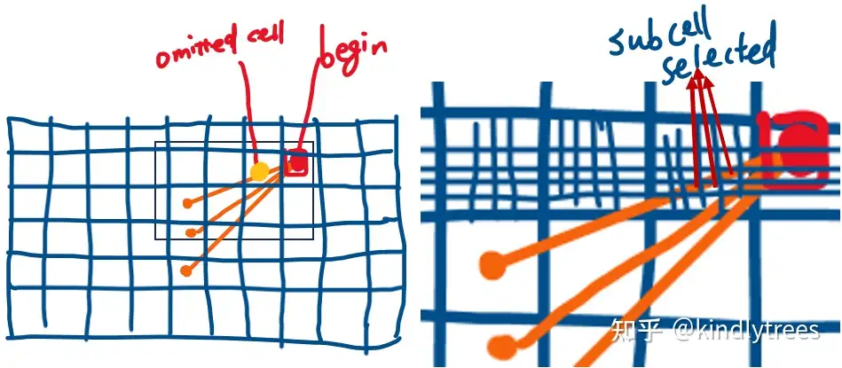

# SLAM系列之cartographer系统中的基于Probability栅格的建图实现分析

本篇文章将向大家介绍cartographer系统中基于概率表示方法的栅格地图建图过程分析，有的地方分析的较为细致，官方没有给出详细的说明，有借助于大模型做了额一定的辅助理解，如对部分内容的理解有疑问或补充欢迎联系作者加以修订，谢谢。

首先向大家介绍基于概率的栅格地图的具体表示方法，基于概率的栅格地图表示其被物体占据的概率(occupancy probability)，在cartographer系统中，采用了特殊的设计，使得其存储表示更新等更加高效，下面先就其表示方法的细节做一下具体的说明。

首先我们介绍一下概率的相关的表示方法和数学原理，首先介绍概率上几个相关的概念定义：(1)、Odds=P/(1-P)，P为概率，Odds称为几率，对数几率(一般称为Log-Odds或Logit)，Logit 将 P 从 [0, 1] 映射到 (-∞, +∞)，这样也符合一般在神经网络里的分类层裸输出的结果(线性输出的范围没有显示约束)一般称为logits，将其进行sigmoid或softmax计算后所得即为实际的概率值。；(2)、点云帧的数据可以理解为观测测量数据，占用概率如果用几率表示，在现有状态下的几率为先验几率Odds_prior，则在给定观测数据条件下的占有几率为后验几率，基于贝叶斯的几率更新规则，可以直接在 Odds 空间进行的贝叶斯更新(可以通过贝叶斯的概率公式进行证明)：Odds_posterior = Odds_measurement * Odds_prior，如当hit_probability =0.55时，odds= 0.55 / (1 – 0.55) = 0.55 / 0.45 ≈ 1.222，Odds_posterior = 1.222 * Odds_prior，因此单元格的一次hit观测，其占用概率/几率会增加。当miss_probability=0.49时，odds= 0.49 / (1 – 0.49) = 0.49 / 0.51 ≈ 0.961，因此单元格的一次miss观测，其占用概率几率会降低。基于odds的贝叶斯公式实现了hit_table_和miss_table_的提前预计算，下面为相关代码。


在基于概率的地图表示方法的基础上，其再次用到了一些技巧实现了高效的计算，如将概率值转化为无符号短整型(具体的实现在代码文件probability_values.h里)，以及将短整型分成左右两半区间，以保证同一个点云帧的所有点云的遍历时概率栅格地图的单元格的值最多只更新一次(更新逻辑在CastRays函数里实现)。接下来根据代码加以分析根据点云帧建图的逻辑。这里关于地图更新的逻辑将以问题的形式进行说明。

问题1：子地图更新的逻辑总体思路是什么样的，如何更新hit或miss单元格栅格？

回答：更新算法在CastRays函数里进行实现，顾名思义，算法基于射线投射的思路，当前点帧的原点位置作为起始位置begin，点云点的坐标位置作为end形成一条射线ray，对点云帧的returns和misses点云点集合形成的rays分别进行相应处理。如下为相关代码和逻辑的解释分析：

```
//.\mapping\2d\probability_grid_range_data_inserter_2d.cc
//begin为点云帧原点位置，end为点云帧坐标点，begin和end为激光发射的ray的表示方法
const Eigen::Array2i begin =
      superscaled_limits.GetCellIndex(range_data.origin.head<2>());
  // Compute and add the end points.
  std::vector<Eigen::Array2i> ends;
  ends.reserve(range_data.returns.size());
  for (const sensor::RangefinderPoint& hit : range_data.returns) {
    //根据射线经过的单元格通过hit_table的查找规则增加其占用概率值，这里有一定的少量的重复计算
    //超分辨率下原始单元格会重复多次调用查找表，但第一次后的查找表更新的操作计算量很小，
    //同时ends变量后面也会用得到，因此保留了代码规整的写法。
    ends.push_back(superscaled_limits.GetCellIndex(hit.position.head<2>()));
    probability_grid->ApplyLookupTable(ends.back() / kSubpixelScale, hit_table);
  }
  //如果配置了对空闲区域的占用概率的更新规则则需要通过射线经过的空闲的cell单元格进行占用概率更新
  if (!insert_free_space) {
    return;
  }

  // Now add the misses.根据射线经过的单元格通过miss_table的查找规则减小其占用概率值
  for (const Eigen::Array2i& end : ends) {
    std::vector<Eigen::Array2i> ray =
        RayToPixelMask(begin, end, kSubpixelScale);
    for (const Eigen::Array2i& cell_index : ray) {
      probability_grid->ApplyLookupTable(cell_index, miss_table);
    }
  }
```

问题2：为什么在基于hit和miss的查找表更新的过程中采用超分辨率进行计算，有哪些考虑？

回答：采用超分辨率的计算方式主要在于对miss的更新更加准确。这里用下面的图示进行说明。



图1： 超分辨率栅格选择示意图
如图1左图所示，由于黄色点所在cell的index和begin的y坐标相同，但x坐标比begin还要小，Bresenham等光线追踪算法可能判定如图所示的三条光束“跳过”了本应标记为 “miss” 的单元格。右图通过进一步细化分辨率，可以看到光线在原先大的单元格的小的单元格的cell的y轴坐标会比begin要大，红色箭头表明这些sub cell会被选中，因此超分辨率主要解决miss” 单元格由于离散化和单元格尺寸过大而导致的精度损失问题。

问题3：子图的维护在ActiveSubmaps2D类里进行，前面的文章中有描述，当前活动的子地图的个数不会超过两个，整个全局的地图信息在哪里维护？
回答：下面的函数调用堆栈及代码片断说明了2D SLAM关键部分的调用及处理流程，全局的数据作为轨迹节点数据会更新到位姿图里作为轨迹节点。

```
//.\cartographer\mapping\internal\global_trajectory_builder.cc
//2D SLAM处理流程关键函数调用代码片段
std::unique_ptr<typename LocalTrajectoryBuilder::MatchingResult>
    matching_result = local_trajectory_builder_->AddRangeData(
        sensor_id, timed_point_cloud_data);
if (matching_result == nullptr) {
  // The range data has not been fully accumulated yet.
  return;
}
kLocalSlamMatchingResults->Increment();
std::unique_ptr<InsertionResult> insertion_result;
if (matching_result->insertion_result != nullptr) {
  kLocalSlamInsertionResults->Increment();
  //将局部结果插入到pose_graph_中以便进行全局优化，全局优化的内容见后面文章专门介绍
  auto node_id = pose_graph_->AddNode(
      matching_result->insertion_result->constant_data, trajectory_id_,
      matching_result->insertion_result->insertion_submaps);
  CHECK_EQ(node_id.trajectory_id, trajectory_id_);
  
//.\cartographer\mapping\internal\2d\local_trajectory_builder_2d.cc
//AddAccumulatedRangeData函数的返回结果，在该函数的实现过程中会调用ScanMatch进行
//位姿优化，同时会调用InsertIntoSubmap(见下个代码片段)将结果调用更新到活动子图，
//并返回含有轨迹节点的数据，轨迹节点作为位姿图的顶点以进行全局位姿优化，
return absl::make_unique<MatchingResult>(
    MatchingResult{time, pose_estimate, std::move(range_data_in_local),
                   std::move(insertion_result)});
  
//.\cartographer\mapping\internal\2d\local_trajectory_builder_2d.cc 
//InsertIntoSubmap函数的返回值，TrajectoryNode::Data为轨迹节点数据类型
return absl::make_unique<InsertionResult>(InsertionResult{
      std::make_shared<const TrajectoryNode::Data>(TrajectoryNode::Data{
          time,
          gravity_alignment,
          filtered_gravity_aligned_point_cloud,
          {},  // 'high_resolution_point_cloud' is only used in 3D.
          {},  // 'low_resolution_point_cloud' is only used in 3D.
          {},  // 'rotational_scan_matcher_histogram' is only used in 3D.
          pose_estimate}),
      std::move(insertion_submaps)});
```

References

[1]、cartographer代码仓： cartographer-project/cartographer