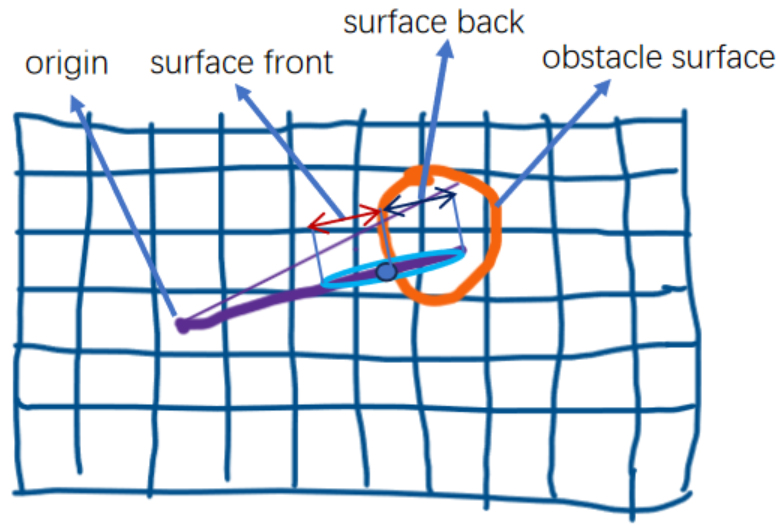

# TSDF
本篇文章将向大家介绍TSDF(Truncated Signed Distance Field，截断符号距离场)表示的二维栅格建图实现，TSDF2D和ProbabilityGrid是两种不同的2D建图的地图表示方法，TSDF 对于三维重建和平滑表面表示特别有用，TSDF用在平面应用场景的作用（以及和probabitliy的应用对比待分析）。接下来也将以问答的形式来介绍相关的技术实现原理。

问题1：如何更加直观理解TSDF的定义，其表示二维地图的几何含义和基于occupancy的概率栅格地图表示法有什么不同？最好有可视化的直觉感官方面的图示解释，以及相关关键代码和注释的说明。



图1：TSDF定义sketch示意图

回答：TSDF定义示意图如图1所示，origin为点云坐标定义的原点(具体的定义参考之前的激光点云数据流转和变换分析一文)，示意图中假设橙色的曲线为物体的二维截面的表面(如室内的桌腿)。紫色的线条为origin到点云点的射线，其中会穿越物体的表面一段距离(truncation_distance，图中的surface back双线箭头所指的ray部分)。更新时需要计算权重，这里一般权重为综合度量，第一个因素为ray的方向和物体表面法线的夹角，如果重叠说明ray垂直扫描物体的表面，否则如果夹角加大(如掠射的时候)，则点云点返回的强度(intensities)一般也会较小，一般精确度也会受影响；第二个因素为距离因素，一般距离越小精度也越高。综合因素可以考虑设计为两个因素的乘积(如上图中两条紫色线条的粗细代表了权重，粗线条由于是垂直扫描，且距离也更近一点，因此权重高)。设置物体背面的负值区域的原因在于由于物体表面的背面的具体几何形态未知，如系统之前运行没有经过，或者基于动态变化的场景，因此设置truncation_distance的半径区域为默认的物体的背面，设置一定的安全空间以便后续更新，也为导航提供更加安全的路径规划。

问题2：二维平面的点云点对应的法线如何定义和求解？

回答：在单个点云点所对应的物体或障碍物外表的水平曲线的切线对应的垂线为法线，如基于点云点的法线估计前，通常会先对点云点按相对于传感器的角度进行排序。这使得邻近点的查找非常高效，因为角度上相邻的点通常在空间上也相邻。

问题3：整个建图的整体思路流程以及关键实现算法？

回答：在点云点的坐标，坐标原点以及点云点法线估计值的基础上进行地图的更新逻辑的思路为基于权重的更新，栅格已有TSDF的值和权重和当前基于点云点信息计算出的TSDF的值和权重进行加权和更新。

这里权重的计算逻辑如下


```
  // Precompute weight factors.
  //预计算权重因子: 初始化法线与射线夹角相关的权重为1。
  float weight_factor_angle_ray_normal = 1.f;
  if (options_.update_weight_angle_scan_normal_to_ray_kernel_bandwidth() !=
      0.f) {
    const Eigen::Vector2f negative_ray = -ray;
    //计算命中点表面法线与射线方向（从命中点指向传感器原点 negative_ray = -ray）之间的夹角angle_ray_normal。
    float angle_ray_normal =
        common::NormalizeAngleDifference(normal - common::atan2(negative_ray));
    //使用高斯核函数 GaussianKernel 根据此夹角计算权重。
    //通常，当射线接近垂直于表面时，权重较高；当射线与表面掠射时，权重较低，因为掠射测量通常更不可靠。        
    weight_factor_angle_ray_normal = GaussianKernel(
        angle_ray_normal,
        options_.update_weight_angle_scan_normal_to_ray_kernel_bandwidth());
  }
  //float weight_factor_range = 1.f;: 初始化距离相关的权重为1。
  // ComputeRangeWeightFactor 根据传感器读数的距离 range 计算权重。通常，距离越远，测量越不可靠，权重越低。
  float weight_factor_range = 1.f;
  if (options_.update_weight_range_exponent() != 0) {
    weight_factor_range = ComputeRangeWeightFactor(
        range, options_.update_weight_range_exponent());
  }
```

更新TSDF的更新方法代码和注释片段如下：

```
//ray_mask为通过函数RayToPixelMask得到的所有需要更新的栅格单元。
//遍历光栅单元格，按TSDF定义的规则对地图进行更新 Update Cells.
for (const Eigen::Array2i& cell_index : ray_mask) {
  //检查该栅格单元是否已经被更新过，这里假设是防止在单次InsertHit内重复更新。
  if (tsdf->CellIsUpdated(cell_index)) continue;
  //获取当前栅格单元的中心点在世界坐标系中的坐标。
  Eigen::Vector2f cell_center = tsdf->limits().GetCellCenter(cell_index);
  //计算栅格中心到传感器原点的距离。
  float distance_cell_to_origin = (cell_center - origin).norm();
  //这是基于投影的SDF计算方法。range 是传感器到表面（hit点）的距离。
  //如果栅格中心在传感器和表面之间(distance_cell_to_origin < range)，则update_tsd>0。
  //如果栅格中心在表面之后(distance_cell_to_origin > range)，则update_tsd<0。
  //update_tsd>0为自由空间，pdate_tsd<0为物体表面的背面
  //此SDF的零点位于以传感器原点为中心、半径为 range 的圆弧上。
  float update_tsd = range - distance_cell_to_origin;
  //如果配置选项要求将SDF投影到扫描法线方向(如果激光射线正对着物体表面的点，则和法线重合）
  if (options_.project_sdf_distance_to_scan_normal()) {
    float normal_orientation = normal;
    //从hit点到cell_center的向量在表面法线方向上的投影长度。
    //由于法线向量是单位向量，这等价于求解有符号距离。
    update_tsd = (cell_center - hit)
                     .dot(Eigen::Vector2f{std::cos(normal_orientation),
                                          std::sin(normal_orientation)});
  }
  //将计算得到的SDF值截断在[-truncation_distance, truncation_distance]范围内。
  update_tsd =
      common::Clamp(update_tsd, -truncation_distance, truncation_distance);
  //组合之前计算的基于距离和法线角度的权重。
  float update_weight = weight_factor_range * weight_factor_angle_ray_normal;
  if (options_.update_weight_distance_cell_to_hit_kernel_bandwidth() != 0.f) {
    //进一步根据SDF值（即栅格与表面的距离）调整权重。通常离表面越近的栅格，其更新权重越高。
    update_weight *= GaussianKernel(
        update_tsd,
        options_.update_weight_distance_cell_to_hit_kernel_bandwidth());
  }
  //将计算得到的SDF值update_tsd和权重update_weight融合到TSDF地图中对应cell_index的栅格。
  //根据cell_index对应的cell原先权重和tsd的值进行加权求和。
  UpdateCell(cell_index, update_tsd, update_weight, tsdf);
}
```

关于全局地图信息的维护等等，由于cartographer系统中面向对象的代码可复用良好的设计模式的使用，整个局部SLAM和全局SLAM的框架结构是复用的，和ProbabilityGrid的地图方法保持一致。
具体可以参考前面文章的描述。