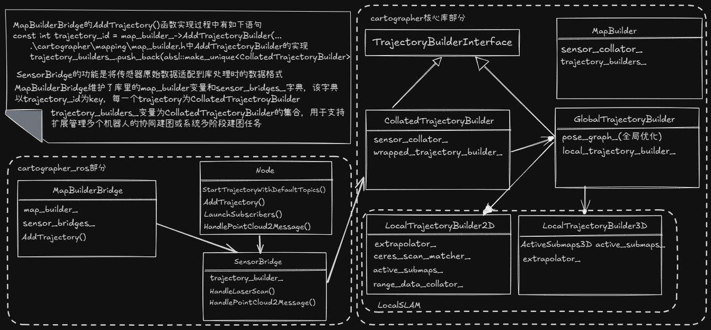

# cartographer的系统流程

## cartographer支持的常用的硬件传感器组合有哪些？

- 典型的传感器配置是什么，是Lidar+IMU+Wheel Odemetry吗？还是idar+IMU？
- 成功部署的典型设备有哪些？如扫地机器人？清洁卫生机器人？
- 是否支持纯视觉，和ORB-SLAM3等比较
- 如果只有Lidar（没有IMU）如何处理SLAM算法
- Wheel Odemetry是否是必选传感器设备项
- Lidar+IMU采用的位姿优化采用了EKF或ESKF算法吗？
- LaserScan和PointCloud2两种数据的区别
  - 对于激光雷达传感器，z轴通常指向上方（x轴指向前方，y轴指向左方，右手系），
  - 2D SLAM，LaserScan（产品有Hokuyo、SICK TIM 系列、RPLIDAR 等）主要用于平面移动机器人，一般为一线束
    - 如家庭室内的平面扫地机器人，AGV/AMR（AGV：Automated Guided Vehicle，AMR：Autonomous Mobile Robot）仓储机器人等
    - 机器人行驶平面上的障碍物（墙壁、家具腿、人腿等）， Lidar 传感器的旋转轴（激光束围绕其旋转的轴）需要尽可能地垂直于地面。
  - 3D SLAM,如 Velodyne, Ouster，多线束，如16，32，64，128等
    - 不同但非常邻近的发射源，并行或高速交叠的激光束发射，点的时间和空间无规则分布，需要通过运动补偿（最有效的方式是基于高时间分辨率的IMU数据进行预积分的方式来进行运动补偿）

## cartographer中FLAGS_configuration_directory的配置项一般有哪些，返回的node_options和trajectory_options典型示例？

- NodeOptions 反应了整体的ros的node节点的一些配置属性，与具体的trajectory（逻辑上独立的、由连续传感器数据驱动的位姿序列单元）独立，
  - 优化算法的一些超参配置
- 而trajectory_options与具体的轨迹相关。这里的轨迹可能的情况有：
  - 多个机器人同时进行协同建图，每个机器人一个轨迹；（Multi-robot Collaborative SLAM），涉及到跨机器人之间的轨迹约束和协同（对齐，融合）
  - 一个机器人不同时刻，比如在停回充电坞下次启动时的轨迹；
  - 每个轨迹的一些特殊配置，如传感器数据属性配置

## submap的数据结构的主要的数据特性描述有哪些，submap和全局地图的关系，以及submap的更新或切换发生在什么时候？

- 对于2D-SLAM，主要是栅格图（x，y）平面图
- 对于3D-SLAM，环境空间表示方法有两种：
  - 主要是voxel map（和Octree的八叉树自适应分辨率的表示法不同），而且有两种分辨率（密集用于局部位姿优化，稀疏用于回环检测）,
  - TSDF，（待补充）
- submap有Finished和Active等多种状态，submap内部的位姿数据是较为准确的（相对于当前submap的起始时刻），由于submap持续时间短、空间范围小，Submap 内部的累积漂移非常小，可以视为局部精确和自洽的，在进行位姿全局优化时整个 Finished Submap 会作为一个刚性单元 (Rigid Unit)来看待
- 后端优化（Pose Graph Optimization）是基于已经处于Finished的状态的submaps进行的全局优化， 整个 Finished Submap 会被平移和旋转（作为一个刚性单元 (Rigid Unit)来看待），以更好地与其他 Submap 对齐融合。
- 没有直接的全局地图，主要是已经处于Finished并且进行全局优化后的submaps集合为全局地图
- submap持续时间在几秒钟到10几秒中的范围，TRAJECTORY_BUILDER_2D.submaps.num_range_data控制每个submap中的帧数，为submap发生切换的一种情况，如果和submap的初始位姿移动距离或角度超过一定阈值（），也有可能发生submap的切换

```
# .\cartographer\configuration_files\trajectory_builder_2d.lua
submaps = {
    num_range_data = 90,
    grid_options_2d = {
      grid_type = "PROBABILITY_GRID",
      resolution = 0.05,
    },

.\cartographer\configuration_files\trajectory_builder_2d.lua

motion_filter = {
    max_time_seconds = 5.,
    max_distance_meters = 0.2,
    max_angle_radians = math.rad(1.),
  },

```

## 整体系统的数据流图，数据从传感器到地图构建的过程中所涉及的相关的类



## 2D-SLAM和3D-SLAM以及3D-SLAM中算法的不同的传感器配置分别采用了什么算法（包括局部位姿优化，回环检测和矫正，全局位姿优化等），以及代码如何组织？
