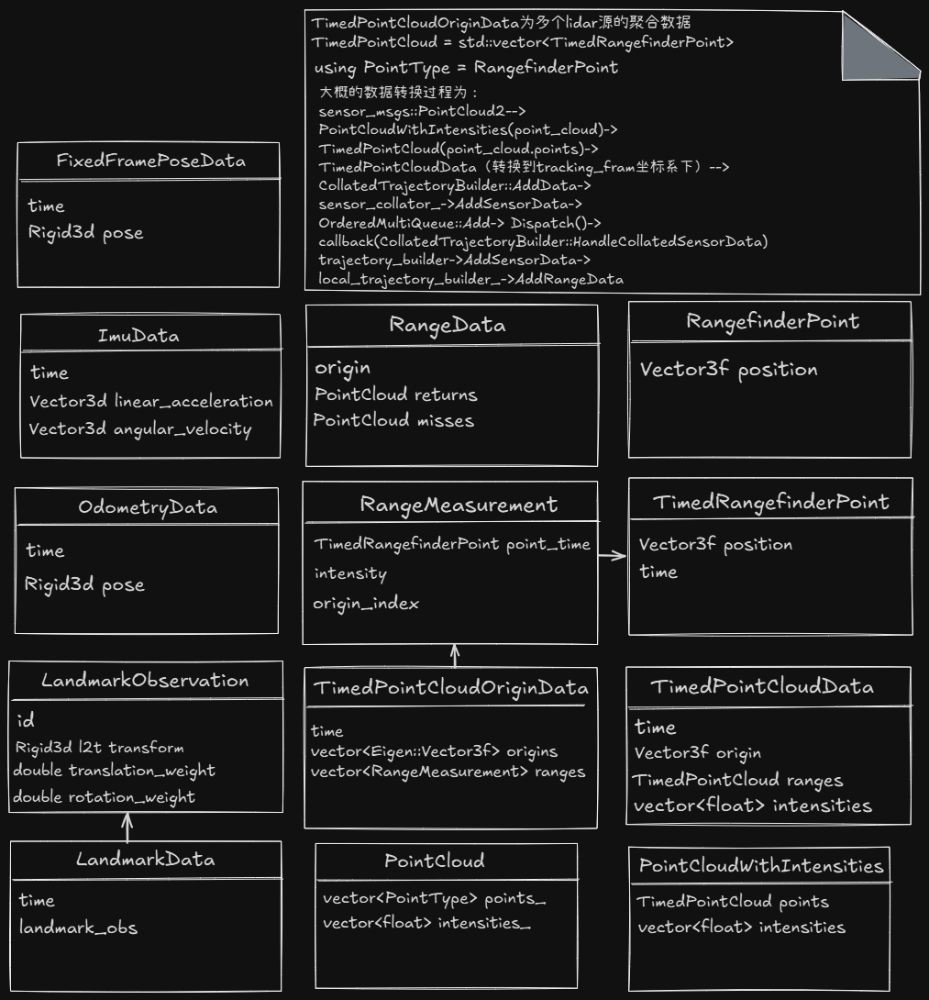

# 传感器模块介绍

## cartographer中常用的传感器有哪些，常用的组合配置有哪些？如LaserScan，Lidar，IMU， Wheel Odometry等，以及通常的传感器配置所支持的应用场景有哪些？

### cartographer中常用的传感器
- LaserScan，通常指2D Lidar（x，y平面数据,如Hokuyo URG-04LX），一般在室内环境中使用（如室内导航、避障、2D SLAM），通过LaserScan来检测墙壁，柱子（桌桌椅的腿）和其他室内障碍物等，在ROS环境中数据类型为`sensor_msgs/LaserScan`；
- Lidar, 3D-SLAM(多线束激光提供x,y,z三维空间观测点云数据,如Velodyne VLP-16)，可以提供更加复杂丰富环境的观测（如自动驾驶、3D建图、地形建模），在ROS环境中数据类型为`sensor_msgs/PointCloud2`
- IMU，提供运动的角速度，线性加速度等测量数据，在ROS环境中数据类型为`sensor_msgs/Imu`
- Wheel Odometry, 提供轮式机器人的里程计数据，通过轮式机器人的轮速测量来估计机器人的位姿，在ROS环境中数据类型为`nav_msgs/Odometry`
- 其他传感器，较少直接用于核心SLAM算法，但可以作为辅助信息提供
  -  GPS，绝对地址，用于闭环检测和全局地图优化
  -  Landmarks，环境中已知的地标，可以作为绝对位姿约束添加到cartographer中，改善定位精度和闭环检测
  -  Camera吗，可以提供视觉里程计，可以以视觉算法检测landmarks，也可以以视觉里程计的输出作为odometry源的输入

- sensor数据相关类图以及数据处理流程说明如下图所示



### cartographer中常用的传感器组合配置及用用场景
- LaserScan(2d Lidar)+Wheel Odometry+IMU为绝大多数室内轮式机器人的常用配置，如仓库AGV，服务机器人，扫地机器人
- Lidar（3d Lidar）+IMU（需要进行3D环境感知的机器人），
  - 应用于手持式建图（https://shop.leica-geosystems.com/leica-blk/blk2go/overview）
  - 背包式3D建图（https://smartspacetech.com.hk/products/backpack-mobile-mapping-system）
  - 空中无人机3D建图
  - 地面机器人，室外环境于自动驾驶等，精细操作与交互

### 传感器的组合如何配置？启动时的逻辑是怎样的？
启动cartographer_ros时有配置文件，里面对相关的属性进行了配置，如 `.\cartographer_ros\cartographer_ros\configuration_files\backpack_3d.lua`等。
Node类对ROS Node进行了封装，实现了消息的订阅，将消息和消息处理函数进行了关联。

### 激光点云数据的处理和封装方法
数据转换过程流图：
`sensor_msgs::PointCloud2`->
`PointCloudWithIntensities`->
`TimedPointCloud`->
`TimedPointCloudData`->
`RangeData`->

具体转换流图说明如下：
- 原始的点云信息为ROS系统标准的消息`sensor_msgs::PointCloud2`，在SensorBridge对数据进行了相关的转换以适配cartographer的核心库。

```
void SensorBridge::HandlePointCloud2Message(
    const std::string& sensor_id,
    const sensor_msgs::PointCloud2::ConstPtr& msg) {
  carto::sensor::PointCloudWithIntensities point_cloud;
  carto::common::Time time;
  std::tie(point_cloud, time) = ToPointCloudWithIntensities(*msg);
  HandleRangefinder(sensor_id, time, msg->header.frame_id, point_cloud.points);
}
```

msg：来自 ROS 的点云消息（包含点坐标、强度、时间戳等）。
将 ROS 的 PointCloud2 格式转为 Cartographer 内部格式 PointCloudWithIntensities，同时提取时间戳。
通过pcl库转化为`pcl::PointCloud<PointXYZIT> pcl_point_cloud;`
```
pcl::fromROSMsg(msg, pcl_point_cloud);
```
然后将pcl_point_cloud转化为`PointCloudWithIntensities`类型的`point_cloud`

```
for (const auto& point : pcl_point_cloud) {
  point_cloud.points.push_back(
      {Eigen::Vector3f{point.x, point.y, point.z}, point.time});
  point_cloud.intensities.push_back(point.intensity);
}
```

然后将`point_cloud`中的每一个点的时间减去整个帧持续的时间，亦即说明其时间为当对于帧结束的相对值，一般为负值。并将timestamp设置为帧扫描的结束时间。
```
::cartographer::common::Time timestamp = FromRos(msg.header.stamp);
if (!point_cloud.points.empty()) {
  const double duration = point_cloud.points.back().time;
  timestamp += cartographer::common::FromSeconds(duration);
  for (auto& point : point_cloud.points) {
    point.time -= duration;
    CHECK_LE(point.time, 0.f)
        << "Encountered a point with a larger stamp than "
            "the last point in the cloud.";
  }
}

return std::make_tuple(point_cloud, timestamp);
```

`tracking_frame` 是所有传感器数据（如激光雷达、IMU、里程计）被统一转换到的参考坐标系；它在配置文件中设定，通常是某个稳定且连续运动的坐标系，
例如：`base_link`,`imu_link`但通常不是地图坐标 map，也不是子图坐标 submap。如

```
// .\cartographer_ros\configuration_files\backpack_2d.lua
options = {
  map_builder = MAP_BUILDER,
  trajectory_builder = TRAJECTORY_BUILDER,
  map_frame = "map",
  tracking_frame = "base_link",
  published_frame = "base_link",
  ...
}
```

`HandleRangefinder`函数将对点云数据做进一步的转换，将点从传感器坐标系变换到 tracking_frame 下，
`sensor_to_tracking->translation().cast<float>()`被用作当前帧点云的“origin”，即该帧点云采集时传感器的位置（tracking frame 下）。
`sensor_to_tracking->cast<float>()`表示将整个 Rigid3d（旋转和平移）从 double 转为 Rigid3f,
`TransformTimedPointCloud`函数然后用于变换每个点云点坐标,把所有点从传感器坐标系转换到 tracking_frame 坐标系下。

```
void SensorBridge::HandleRangefinder(
    const std::string& sensor_id, const carto::common::Time time,
    const std::string& frame_id, const carto::sensor::TimedPointCloud& ranges) {
  if (!ranges.empty()) {
    CHECK_LE(ranges.back().time, 0.f);
  }
  //将点从传感器坐标系变换到 tracking_frame 下
  const auto sensor_to_tracking =
      tf_bridge_.LookupToTracking(time, CheckNoLeadingSlash(frame_id));
  if (sensor_to_tracking != nullptr) {
    if (IgnoreMessage(sensor_id, time)) {
      LOG(WARNING) << "Ignored Rangefinder message from sensor " << sensor_id
                   << " because sensor time " << time
                   << " is not before last Rangefinder message time "
                   << latest_sensor_time_[sensor_id];
      return;
    }
    latest_sensor_time_[sensor_id] = time;
    trajectory_builder_->AddSensorData(
        sensor_id, carto::sensor::TimedPointCloudData{
                       time, sensor_to_tracking->translation().cast<float>(),
                       carto::sensor::TransformTimedPointCloud(
                           ranges, sensor_to_tracking->cast<float>())});
  }
}
```

接下来，在cartographer的库中，对点云数据需要做进一步的预处理，主要是同步点云数据，以支持多个Lidar传感器的硬件配置。
实现数据同步的类为`RangeDataCollator`，其实现了点云数据的裁剪和融合，将多个点云数据流融合成一个单一的点云数据流，
就像集成的一个单一的激光点云传感器一样，可以看成是多个激光传感器经过逻辑处理虚拟化成一个更加强大的激光传感器。
数据类型也从`TimedPointCloudData`融合为`TimedPointCloudOriginData`。
关于`RangeDataCollator`类的详细说明，可以参考[RangeDataCollator类说明文档](../mappping/RangeDataCollator.md)。

在Local SLAM中（以2D场景为例），会进一步将`TimedPointCloudOriginData`转化为`RangeData`，
具体的实现分析参考[LocalTrajectoryBuilder2D.md](../mappping/2d/LocalTrajectoryBuilder2D.md)。

### 其他传感器数据的处理和封装方法
- 其他传感器数据的处理流程类似，但是和激光点云的稍有不同的地方在于其没有同步和融合的过程，如ImuData和OdometryData，直接在`LocalTrajectoryBuilder2D`类的实现里传递给了`extrapolator_`以便进行位姿的初始估计。

## 传感器模块的代码主要在哪里体现，cartographer和cartographer_ros中分别对应senssor部分的代码功能介绍？

### cartographer_ros部分关于sensors数据流程处理

- Node类实现传感器的消息订阅和处理（更多关于数据的流程处理，也可以参考下一个问题的描述）
```
// .\cartographer_ros\cartographer_ros\cartographer_ros\node.cc

//注册消息订阅器，以LaserScan Message为例
void Node::LaunchSubscribers(const TrajectoryOptions& options,
                             const int trajectory_id) {
  for (const std::string& topic :
       ComputeRepeatedTopicNames(kLaserScanTopic, options.num_laser_scans)) {
    subscribers_[trajectory_id].push_back(
        {SubscribeWithHandler<sensor_msgs::LaserScan>(
             &Node::HandleLaserScanMessage, trajectory_id, topic, &node_handle_,
             this),
         topic});
  }

//处理消息，通过sensor_bridge的HandleLaserScanMessage函数转化为cartographer的库所能处理的数据类型
void Node::HandleLaserScanMessage(const int trajectory_id,
                                  const std::string& sensor_id,
                                  const sensor_msgs::LaserScan::ConstPtr& msg) {
  absl::MutexLock lock(&mutex_);
  if (!sensor_samplers_.at(trajectory_id).rangefinder_sampler.Pulse()) {
    return;
  }
  map_builder_bridge_.sensor_bridge(trajectory_id)
      ->HandleLaserScanMessage(sensor_id, msg);
}

//类似处理点云信息
void Node::HandlePointCloud2Message(
    const int trajectory_id, const std::string& sensor_id,
    const sensor_msgs::PointCloud2::ConstPtr& msg) {
  absl::MutexLock lock(&mutex_);
  if (!sensor_samplers_.at(trajectory_id).rangefinder_sampler.Pulse()) {
    return;
  }
  map_builder_bridge_.sensor_bridge(trajectory_id)
      ->HandlePointCloud2Message(sensor_id, msg);
}
```

- SensorBridge类实现简单时间过滤机制 和 数据适配 两个关键环节
```
// 实现代码文件路径： .\cartographer_ros\cartographer_ros\cartographer_ros\sensor_bridge.cc
void SensorBridge::HandleLaserScan(
    const std::string& sensor_id, const carto::common::Time time,
    const std::string& frame_id,
    const carto::sensor::PointCloudWithIntensities& points) {
  if (points.points.empty()) {
    return;
  }
  CHECK_LE(points.points.back().time, 0.f);
  // TODO(gaschler): Use per-point time instead of subdivisions.
  for (int i = 0; i != num_subdivisions_per_laser_scan_; ++i) {
    const size_t start_index =
        points.points.size() * i / num_subdivisions_per_laser_scan_;
    const size_t end_index =
        points.points.size() * (i + 1) / num_subdivisions_per_laser_scan_;
    carto::sensor::TimedPointCloud subdivision(
        points.points.begin() + start_index, points.points.begin() + end_index);
    if (start_index == end_index) {
      continue;
    }
    const double time_to_subdivision_end = subdivision.back().time;
    // `subdivision_time` is the end of the measurement so sensor::Collator will
    // send all other sensor data first.
    const carto::common::Time subdivision_time =
        time + carto::common::FromSeconds(time_to_subdivision_end);
    auto it = sensor_to_previous_subdivision_time_.find(sensor_id);
    if (it != sensor_to_previous_subdivision_time_.end() &&
        it->second >= subdivision_time) {
      LOG(WARNING) << "Ignored subdivision of a LaserScan message from sensor "
                   << sensor_id << " because previous subdivision time "
                   << it->second << " is not before current subdivision time "
                   << subdivision_time;
      continue;
    }
    sensor_to_previous_subdivision_time_[sensor_id] = subdivision_time;
    for (auto& point : subdivision) {
      point.time -= time_to_subdivision_end;
    }
    CHECK_EQ(subdivision.back().time, 0.f);
    HandleRangefinder(sensor_id, subdivision_time, frame_id, subdivision);
  }
}

void SensorBridge::HandleRangefinder(
    const std::string& sensor_id, const carto::common::Time time,
    const std::string& frame_id, const carto::sensor::TimedPointCloud& ranges) {
  if (!ranges.empty()) {
    CHECK_LE(ranges.back().time, 0.f);
  }
  const auto sensor_to_tracking =
      tf_bridge_.LookupToTracking(time, CheckNoLeadingSlash(frame_id));
  if (sensor_to_tracking != nullptr) {
    if (IgnoreMessage(sensor_id, time)) {
      LOG(WARNING) << "Ignored Rangefinder message from sensor " << sensor_id
                   << " because sensor time " << time
                   << " is not before last Rangefinder message time "
                   << latest_sensor_time_[sensor_id];
      return;
    }
    latest_sensor_time_[sensor_id] = time;
    trajectory_builder_->AddSensorData(
        sensor_id, carto::sensor::TimedPointCloudData{
                       time, sensor_to_tracking->translation().cast<float>(),
                       carto::sensor::TransformTimedPointCloud(
                           ranges, sensor_to_tracking->cast<float>())});
  }
}

```

## cartographer中Map builder，trajectory_builder以及传感器数据在进入到collator之前的数据流向，以及collator和trajectory_colloator等之间的关系是什么？

该问题和第二个问题高度相关，这里梳理一下数据从cartographer_ros的node节点订阅接收ros的标准信息后，如何通过SensorBridge和

```
// 初始化时在进入构造函数之前调用了map_builder_bridge_的初始化，
//.\cartographer_ros\cartographer_ros\cartographer_ros\node.cc 
Node::Node(
    const NodeOptions& node_options,
    std::unique_ptr<cartographer::mapping::MapBuilderInterface> map_builder,
    tf2_ros::Buffer* const tf_buffer, const bool collect_metrics)
    : node_options_(node_options),
      map_builder_bridge_(node_options_, std::move(map_builder), tf_buffer) 

// .\cartographer_ros\cartographer_ros\cartographer_ros\node_main.cc

  if (FLAGS_start_trajectory_with_default_topics) {
    node.StartTrajectoryWithDefaultTopics(trajectory_options);
  }

// .\cartographer_ros\cartographer_ros\cartographer_ros\node.cc
void Node::StartTrajectoryWithDefaultTopics(const TrajectoryOptions& options) {
  absl::MutexLock lock(&mutex_);
  CHECK(ValidateTrajectoryOptions(options));
  AddTrajectory(options);
}

//添加trajectory（可以理解为添加一个机器人系统）
int Node::AddTrajectory(const TrajectoryOptions& options) {
  const std::set<cartographer::mapping::TrajectoryBuilderInterface::SensorId>
      expected_sensor_ids = ComputeExpectedSensorIds(options);
  const int trajectory_id =
      map_builder_bridge_.AddTrajectory(expected_sensor_ids, options);
  AddExtrapolator(trajectory_id, options);
  AddSensorSamplers(trajectory_id, options);
  LaunchSubscribers(options, trajectory_id);
  wall_timers_.push_back(node_handle_.createWallTimer(
      ::ros::WallDuration(kTopicMismatchCheckDelaySec),
      &Node::MaybeWarnAboutTopicMismatch, this, /*oneshot=*/true));
  for (const auto& sensor_id : expected_sensor_ids) {
    subscribed_topics_.insert(sensor_id.id);
  }
  return trajectory_id;
}


//注册消息订阅器，以LaserScan Message为例
void Node::LaunchSubscribers(const TrajectoryOptions& options,
                             const int trajectory_id) {
  for (const std::string& topic :
       ComputeRepeatedTopicNames(kLaserScanTopic, options.num_laser_scans)) {
    subscribers_[trajectory_id].push_back(
        {SubscribeWithHandler<sensor_msgs::LaserScan>(
             &Node::HandleLaserScanMessage, trajectory_id, topic, &node_handle_,
             this),
         topic});
  }

//处理消息，通过sensor_bridge的HandleLaserScanMessage函数转化为cartographer的库所能处理的数据类型
void Node::HandleLaserScanMessage(const int trajectory_id,
                                  const std::string& sensor_id,
                                  const sensor_msgs::LaserScan::ConstPtr& msg) {
  absl::MutexLock lock(&mutex_);
  if (!sensor_samplers_.at(trajectory_id).rangefinder_sampler.Pulse()) {
    return;
  }
  map_builder_bridge_.sensor_bridge(trajectory_id)
      ->HandleLaserScanMessage(sensor_id, msg);
}


void SensorBridge::HandleLaserScanMessage(
    const std::string& sensor_id, const sensor_msgs::LaserScan::ConstPtr& msg) {
  carto::sensor::PointCloudWithIntensities point_cloud;
  carto::common::Time time;
  std::tie(point_cloud, time) = ToPointCloudWithIntensities(*msg);
  HandleLaserScan(sensor_id, time, msg->header.frame_id, point_cloud);
}

// 根据时间排除乱序到达的数据，保证加入到队列中的数据是有序的
void SensorBridge::HandleLaserScan(
    const std::string& sensor_id, const carto::common::Time time,
    const std::string& frame_id,
    const carto::sensor::PointCloudWithIntensities& points) {
  if (points.points.empty()) {
    return;
  }
  CHECK_LE(points.points.back().time, 0.f);
  // TODO(gaschler): Use per-point time instead of subdivisions.
  for (int i = 0; i != num_subdivisions_per_laser_scan_; ++i) {
    const size_t start_index =
        points.points.size() * i / num_subdivisions_per_laser_scan_;
    const size_t end_index =
        points.points.size() * (i + 1) / num_subdivisions_per_laser_scan_;
    carto::sensor::TimedPointCloud subdivision(
        points.points.begin() + start_index, points.points.begin() + end_index);
    if (start_index == end_index) {
      continue;
    }
    const double time_to_subdivision_end = subdivision.back().time;
    // `subdivision_time` is the end of the measurement so sensor::Collator will
    // send all other sensor data first.
    const carto::common::Time subdivision_time =
        time + carto::common::FromSeconds(time_to_subdivision_end);
    auto it = sensor_to_previous_subdivision_time_.find(sensor_id);
    if (it != sensor_to_previous_subdivision_time_.end() &&
        it->second >= subdivision_time) {
      LOG(WARNING) << "Ignored subdivision of a LaserScan message from sensor "
                   << sensor_id << " because previous subdivision time "
                   << it->second << " is not before current subdivision time "
                   << subdivision_time;
      continue;
    }
    sensor_to_previous_subdivision_time_[sensor_id] = subdivision_time;
    for (auto& point : subdivision) {
      point.time -= time_to_subdivision_end;
    }
    CHECK_EQ(subdivision.back().time, 0.f);
    HandleRangefinder(sensor_id, subdivision_time, frame_id, subdivision);
  }
}


// 通过trajectory_builder_->AddSensorData加入到队列中，具体的实现在cartographer核心库里
// trajectory_builder_为哪个呢，应该是CollatedTrajectoryBuilder
void SensorBridge::HandleRangefinder(
    const std::string& sensor_id, const carto::common::Time time,
    const std::string& frame_id, const carto::sensor::TimedPointCloud& ranges) {
  if (!ranges.empty()) {
    CHECK_LE(ranges.back().time, 0.f);
  }
  const auto sensor_to_tracking =
      tf_bridge_.LookupToTracking(time, CheckNoLeadingSlash(frame_id));
  if (sensor_to_tracking != nullptr) {
    if (IgnoreMessage(sensor_id, time)) {
      LOG(WARNING) << "Ignored Rangefinder message from sensor " << sensor_id
                   << " because sensor time " << time
                   << " is not before last Rangefinder message time "
                   << latest_sensor_time_[sensor_id];
      return;
    }
    latest_sensor_time_[sensor_id] = time;
    trajectory_builder_->AddSensorData(
        sensor_id, carto::sensor::TimedPointCloudData{
                       time, sensor_to_tracking->translation().cast<float>(),
                       carto::sensor::TransformTimedPointCloud(
                           ranges, sensor_to_tracking->cast<float>())});
  }
}

// .\cartographer\cartographer\mapping\internal\collated_trajectory_builder.h
void AddSensorData(
    const std::string& sensor_id,
    const sensor::TimedPointCloudData& timed_point_cloud_data) override {
  AddData(sensor::MakeDispatchable(sensor_id, timed_point_cloud_data));
}

//  .\cartographer\cartographer\mapping\internal\collated_trajectory_builder.cc
void CollatedTrajectoryBuilder::AddData(std::unique_ptr<sensor::Data> data) {
  sensor_collator_->AddSensorData(trajectory_id_, std::move(data));
}


//cartographer_ros中创建trajectory
int MapBuilderBridge::AddTrajectory(
    const std::set<cartographer::mapping::TrajectoryBuilderInterface::SensorId>&
        expected_sensor_ids,
    const TrajectoryOptions& trajectory_options) {
  const int trajectory_id = map_builder_->AddTrajectoryBuilder(
      expected_sensor_ids, trajectory_options.trajectory_builder_options,
      [this](const int trajectory_id, const ::cartographer::common::Time time,
             const Rigid3d local_pose,
             ::cartographer::sensor::RangeData range_data_in_local,
             const std::unique_ptr<
                 const ::cartographer::mapping::TrajectoryBuilderInterface::
                     InsertionResult>) {
        OnLocalSlamResult(trajectory_id, time, local_pose, range_data_in_local);
      });
  LOG(INFO) << "Added trajectory with ID '" << trajectory_id << "'.";


//进一步调用cartographer核心库中的mapbuilder的AddTrajectoryBuilder函数定义
int MapBuilder::AddTrajectoryBuilder(
    const std::set<SensorId>& expected_sensor_ids,
    const proto::TrajectoryBuilderOptions& trajectory_options,
    LocalSlamResultCallback local_slam_result_callback)


//上面AddTrajectoryBuilder函数的片段构建了`LocalTrajectoryBuilder2D`和`CollatedTrajectoryBuilder`
else {
    std::unique_ptr<LocalTrajectoryBuilder2D> local_trajectory_builder;
    if (trajectory_options.has_trajectory_builder_2d_options()) {
      local_trajectory_builder = absl::make_unique<LocalTrajectoryBuilder2D>(
          trajectory_options.trajectory_builder_2d_options(),
          SelectRangeSensorIds(expected_sensor_ids));
    }
    DCHECK(dynamic_cast<PoseGraph2D*>(pose_graph_.get()));
    trajectory_builders_.push_back(absl::make_unique<CollatedTrajectoryBuilder>(
        trajectory_options, sensor_collator_.get(), trajectory_id,
        expected_sensor_ids,
        CreateGlobalTrajectoryBuilder2D(
            std::move(local_trajectory_builder), trajectory_id,
            static_cast<PoseGraph2D*>(pose_graph_.get()),
            local_slam_result_callback, pose_graph_odometry_motion_filter)));
  }
  MaybeAddPureLocalizationTrimmer(trajectory_id, trajectory_options,
                                  pose_graph_.get());


//CollatedTrajectoryBuilder的构造函数，其中wrapped_trajectory_builder即CreateGlobalTrajectoryBuilder2D函数的返回值，为LocalSLAM和PoseGraph的包装类，实现全局优化所用
CollatedTrajectoryBuilder(
    const proto::TrajectoryBuilderOptions& trajectory_options,
    sensor::CollatorInterface* sensor_collator, int trajectory_id,
    const std::set<SensorId>& expected_sensor_ids,
    std::unique_ptr<TrajectoryBuilderInterface> wrapped_trajectory_builder);


//LocalTrajectoryBuilder2D为local SLAM，基于最小二乘的位姿优化
//CollatedTrajectoryBuilder为trajetory的传感器数据的整理调度器，将不同传感器数据按时序发送给LocalSLAM（待确认）？
//CreateGlobalTrajectoryBuilder2D建立局部位姿优化SLAM和全局位姿优化SLAM的桥梁
```

## 点云数据在cartographer核心库中的数据处理及流转过程分析 
- `TimedPointCloudData`->`TimedPointCloudOriginData`
在经过`RangeDataCollator`类的点云数据同步后返回`TimedPointCloudOriginData`类型的数据（有一到多个源的激光数据）。
`TimedPointCloudOriginData`类多个源的origin是不是都是相对于`tracking_frame`的，但是点云点都已经对齐到了`tracking_frame`下，
具体的转换实现在SensorBridge类里进行的。

```
trajectory_builder_->AddSensorData(
    sensor_id, carto::sensor::TimedPointCloudData{
                    time, sensor_to_tracking->translation().cast<float>(),
                    carto::sensor::TransformTimedPointCloud(
                        ranges, sensor_to_tracking->cast<float>())});
```

因此不同lidar传感器的点云点坐标采用了统一的坐标系。记录origin以便区分点云来源，并方便对点云进行运动补偿。
- `TimedPointCloudOriginData`->`RangeData`
见``LocalTrajectoryBuilder2D::AddRangeData`函数的实现。

