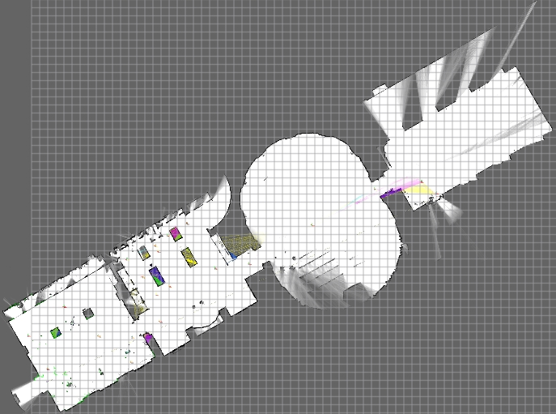

# Cartographer以及Cartographer ROS编译指南

- 在安装Cartographer ROS前,需安装Cartographer
- 系统环境 Ubuntu20.04/focal
- su到非root用户

## Cartographer安装依赖

```bash
sudo apt-get update
sudo apt-get install -y \
    clang \
    cmake \
    g++ \
    git \
    google-mock \
    libboost-all-dev \
    libcairo2-dev \
    libceres-dev \
    libcurl4-openssl-dev \
    libeigen3-dev \
    libgflags-dev \
    libgoogle-glog-dev \
    liblua5.2-dev \
    libsuitesparse-dev \
    lsb-release \
    ninja-build \
    python3-sphinx \
    stow

# Install Protocol Buffers and Abseil if available.
# No need to build it ourselves.
case "$(lsb_release -sc)" in
    jammy|bullseye)
        sudo apt-get install -y libgmock-dev protobuf-compiler libabsl-dev ;;
    focal|buster)
        sudo apt-get install -y libgmock-dev protobuf-compiler ;;
    bionic)
        ;;
esac
```

## 安装abseil-cpp

介绍from chatgpt: abseil-cpp 是 Abseil 项目的 C++ 实现版本，由 Google 开源维护，它提供了一组基础设施库，填补了 C++ 标准库的空白，并对其进行增强和扩展。
这是 Google 内部 C++ 项目的重要构建基石，也被广泛用于 TensorFlow、gRPC、Cartographer、TFLite 等开源项目中。

建议cd到workspace工作区目录下，先clone cartography代码，`git clone https://github.com/cartographer-project/cartographer.git` 然后再 `cartographer`根目录下创建 `thrid_party`文件夹，然后cd到 `third_party`文件夹下，执行以下命令：

```bash
git clone https://github.com/abseil/abseil-cpp.git
cd abseil-cpp
git checkout 215105818dfde3174fe799600bb0f3cae233d0bf # 20211102.0
mkdir build
cd build
cmake -G Ninja \
  -DCMAKE_BUILD_TYPE=Release \
  -DCMAKE_POSITION_INDEPENDENT_CODE=ON \
  -DCMAKE_INSTALL_PREFIX=/usr/local/stow/absl \
  ..
ninja
sudo ninja install
cd /usr/local/stow
sudo stow absl

# 注：上面两行命令的作用是使用 GNU Stow 工具，将已安装的 absl（abseil-cpp）库通过符号链接的方式“激活”到系统路径中（比如 /usr/local/include 和 /usr/local/lib）。
# ninja 是一个极其高效的构建工具,适用于追求速度和增量编译优化的项目,通常搭配 CMake 使用，无需手写 .ninja 文件，如
# cmake -G Ninja .
# ninja
```

- 如若在 `git checkout`时有报错,按照提示输入即可

```bash
VERSION="v3.4.1"

# Build and install proto3.
git clone https://github.com/google/protobuf.git
cd protobuf
git checkout tags/${VERSION}
mkdir build_dir
cd build_dir
cmake -G Ninja \
  -DCMAKE_POSITION_INDEPENDENT_CODE=ON \
  -DCMAKE_BUILD_TYPE=Release \
  -Dprotobuf_BUILD_TESTS=OFF \
  ../cmake
ninja
sudo ninja install
```

- 编译cartographer

```bash
# Build and install Cartographer.
git clone https://github.com/cartographer-project/cartographer.git
cd cartographer
mkdir build
cd build
cmake .. -G Ninja
ninja
CTEST_OUTPUT_ON_FAILURE=1 ninja test
sudo ninja install
```

## Cartographer ROS 编译

- 支持ROS版本为 `Melodic`/`Noetic`

### 安装依赖

在带有 ROS Noetic 的 Ubuntu Focal 上，使用以下命令安装上述工具：

```bash
sudo apt-get update
sudo apt-get install -y python3-wstool python3-rosdep ninja-build stow
```

在较旧的发行版中：

```bash
sudo apt-get update
sudo apt-get install -y python-wstool python-rosdep ninja-build stow
```

安装工具后，在“catkin_ws”中创建一个新的cartographer_ros工作区。

```bash
mkdir catkin_ws
cd catkin_ws
wstool init src
wstool merge -t src https://raw.githubusercontent.com/cartographer-project/cartographer_ros/master/cartographer_ros.rosinstall
wstool update -t src
```

```
wstool merge -t src https://raw.githubusercontent.com/cartographer-project/cartographer_ros/master/cartographer_ros.rosinstall 这个步骤出现错误
 
ERROR in config: Unable to download URL [https://raw.githubusercontent.com/cartographer-project/cartographer_ros/master/cartographer_ros.rosinstall]: <urlopen error [SSL: CERTIFICATE_VERIFY_FAILED] certificate verify failed: unable to get local issuer certificate (_ssl.c:1145)>

curl -O https://raw.githubusercontent.com/cartographer-project/cartographer_ros/master/cartographer_ros.rosinstall
wstool init src cartographer_ros.rosinstall

```

现在您需要安装 cartographer_ros 的依赖项。首先，我们使用rosdep安装所需的软件包。如果您在安装 ROS 后已经执行过命令“sudo rosdep init”，则该命令将打印错误。此错误可以忽略。

```bash
sudo rosdep init
rosdep update
rosdep install --from-paths src --ignore-src --rosdistro=${ROS_DISTRO} -y

rosdep install --from-paths src --ignore-src --rosdistro noetic -y --skip-keys="libabsl-dev"


ERROR: the following packages/stacks could not have their rosdep keys resolved
to system dependencies:
fast_livo: Cannot locate rosdep definition for [livox_ros_driver]

cd ~/catkin_ws/src
git clone https://github.com/Livox-SDK/livox_ros_driver.git
cd ..
rosdep install --from-paths src --ignore-src --rosdistro noetic -y --skip-keys="libabsl-dev"
```

Cartographer 使用abseil-cpp库，需要使用此脚本手动安装：

```bash
src/cartographer/scripts/install_abseil.sh
```

由于版本冲突，你可能需要使用以下方法卸载 ROS abseil-cpp

```bash
sudo apt-get remove ros-${ROS_DISTRO}-abseil-cpp
```

构建并安装。

```bash
catkin_make_isolated --install --use-ninja

source ~/catkin_ws/install_isolated/setup.bash
```

- 也可以加入至 .bashrc中

echo source ~/catkin_ws/install_isolated/setup.bash >> ~/.bashrc

### 运行示例

- 下载2D数据包并播放

```bash
wget -P ~/Downloads https://storage.googleapis.com/cartographer-public-data/bags/backpack_2d/cartographer_paper_deutsches_museum.bag

roslaunch cartographer_ros demo_backpack_2d.launch bag_filename:=${HOME}/Downloads/cartographer_paper_deutsches_museum.bag


[ INFO] [1744891727.392547284]: I0417 20:08:47.000000 26770 map_builder_bridge.cc:135] Added trajectory with ID '0'.
[ INFO] [1744891727.639295805, 1432647016.669139320]: I0417 20:08:47.000000 26770 ordered_multi_queue.cc:172] All sensor data for trajectory 0 is available starting at '635682438166225009'.
[ INFO] [1744891727.639565157, 1432647016.669139320]: I0417 20:08:47.000000 26770 local_trajectory_builder_2d.cc:135] Extrapolator is still initializing.
[ INFO] [1744891727.671811858, 1432647016.699744357]: I0417 20:08:47.000000 26770 pose_graph_2d.cc:148] Inserted submap (0, 0).
qt.qpa.xcb: could not connect to display
qt.qpa.plugin: Could not load the Qt platform plugin "xcb" in "/root/CoppeliaSim" even though it was found.
This application failed to start because no Qt platform plugin could be initialized. Reinstalling the application may fix this problem.

Available platform plugins are: eglfs, linuxfb, minimal, minimalegl, offscreen, vnc, xcb.

echo $LD_LIBRARY_PATH
/home/lsxu/catkin_ws/install_isolated/lib:/opt/ros/noetic/lib:/usr/lib/x86_64-linux-gnu/qt5:/root/CoppeliaSim

export LD_LIBRARY_PATH=$(echo "$LD_LIBRARY_PATH" | tr ':' '\n' | grep -v "^/root/CoppeliaSim$" | paste -sd:)

export DISPLAY=:0  #它告诉图形程序：“请把图形界面窗口显示在本地机器的第一个 X Server（显示器）上。”  修复 Qt 程序提示找不到 display, qt.qpa.xcb: could not connect to display
然后再运行

roslaunch cartographer_ros demo_backpack_2d.launch bag_filename:=${HOME}/Downloads/cartographer_paper_deutsches_museum.bag
```

运行结果可视化 

- 下载3D数据包并播放(该数据包较大)

```bash
wget -P ~/Downloads https://storage.googleapis.com/cartographer-public-data/bags/backpack_3d/with_intensities/b3-2016-04-05-14-14-00.bag
roslaunch cartographer_ros demo_backpack_3d.launch bag_filename:=${HOME}/Downloads/b3-2016-04-05-14-14-00.bag`
```
